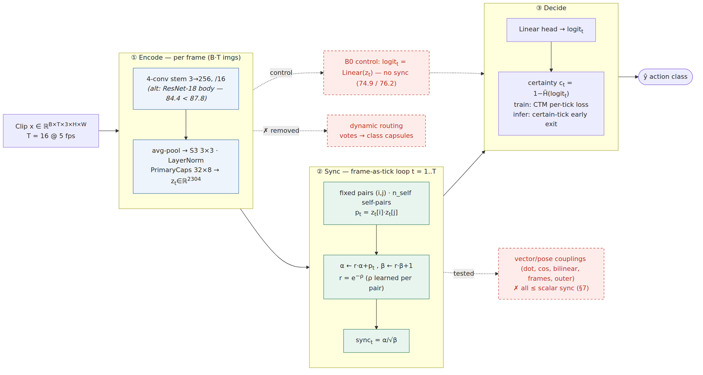
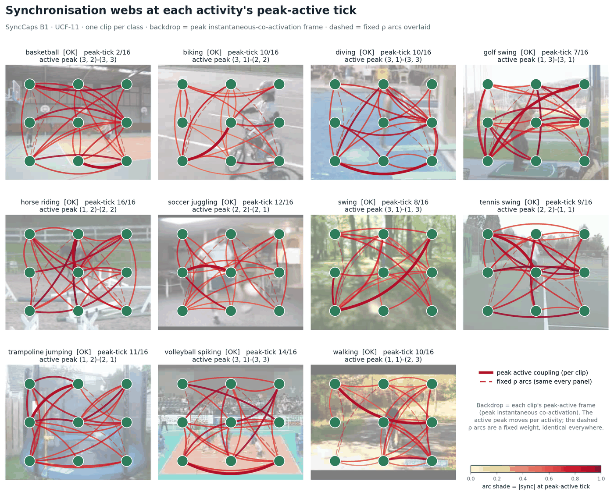
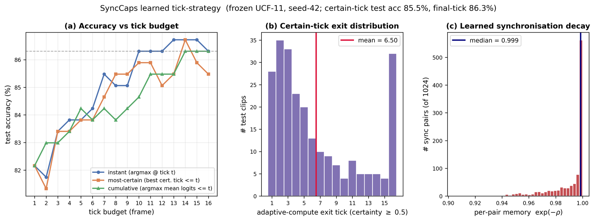

# SyncCaps — reviewer verification record

**Dynamic routing is the canonical way to read a class decision out of a capsule network. It
is also the most expensive stage — an iterative, data-dependent inner loop whose per-clip cost
is a distribution over inputs rather than a fixed budget. SyncCaps removes it.**

The readout is replaced by *PairwiseSync*: a fixed linear map over a decay-weighted
accumulator of pairwise products between primary-capsule activations, treating the frames of a
clip as the internal ticks of a Continuous Thought Machine. No votes, no softmax over capsules,
no routing iterations, no class capsules — so per-clip inference cost is deterministic and
statically schedulable.

Under a same-stem control that swaps **only** the readout, this adds **+12.9 points on UCF-11**
and **+10.4 on UCF101-full**, while the readout itself gets *cheaper* than the linear head it
replaces (12,299 vs. 25,355 parameters).



*The shared encoder produces per-frame primary capsules (one tick per frame). Branch B1
accumulates decay-weighted pairwise products into sync = α/√β and applies a single linear head;
the dashed B0 control reads the same features linearly, holding everything else fixed. Dynamic
routing is removed entirely.*

This repository is the **verification record** for the manuscript: the per-seed results, the run
configuration, the provenance of every figure, and a script that recomputes every published
number. It is not the model source — see *Deliberately not here* below.

## Verify the published numbers

```bash
python verify.py
```

Standard library only — no install, no dataset, no GPU, runs in under a second. It recomputes
every published mean, gap and cost figure from `data/*.json` and fails loudly on any mismatch:

```
  ok   T1  UCF-11   B1_sync   mean                     87.76   paper     87.80
  ok   T1  UCF101   delta (from rounded means)         10.40   paper     10.40
  ---- T1  UCF101   delta (unrounded, for reference)   10.33
  ok   S7  B2_gram  mean (rho frozen at 0)             86.51   paper     86.50
  ...
  All checks passed — every published value matches the archived logs.
```

Where the manuscript rounds differently from the raw logs, the script reports both forms rather
than hiding the difference.

## What the readout actually learns



*One clip per class. Each arc connects two cells of the 3×3 capsule grid, drawn at the clip's
peak-active tick; the bold arc is the strongest active coupling and lands at a different grid
cell for each activity — content-driven and roughly where the motion is. The dashed arcs are the
four highest-decay pairs: a fixed, input-independent weight, identical in every panel.*

That contrast is the paper's main negative result. Where synchrony concentrates is
content-specific, but its **order sensitivity is not used**. Across the 1024 UCF-11 pairs the
learned memory e^−ρ spans [0.904, 1.000] with median 0.998 — within a few percent of the
order-agnostic limit.



*(a) accuracy versus tick budget; (b) the distribution of certain-tick exits, mean ≈ 6.5 of 16;
(c) the histogram of learned per-pair memory, concentrated at the no-decay end.*

Freezing the decay at zero — making the statistic exactly an order-agnostic Gram entry — costs
1.2 points of two-seed accuracy and **nothing at all** on the hybrid metric (86.10 vs. 86.10),
with the frozen arm's better seed exceeding both seeds of the learned-decay arm. The leverage is
the second-order co-activation representation, not temporal order.

## Datasets

Both benchmarks are public and were used as distributed — no re-collection, no private splits.
The stratified S3 partition is derived deterministically from the run seed.

| Dataset | Clips | Classes | Source |
|---|---:|---:|---|
| UCF-11 (UCF YouTube Action) | 1,600 | 11 | https://www.crcv.ucf.edu/data/UCF_YouTube_Action.php |
| UCF101 | 13,320 | 101 | https://www.crcv.ucf.edu/data/UCF101.php |

UCF-11 is used in its updated release (clips converted to 29.97 fps MPEG). Every clip is decoded
to 16 frames sampled at 5 fps before training.

## Retraining an arm

Retraining needs the datasets above, PyTorch and one GPU — roughly an hour per arm. The
configuration is identical across every arm compared within a dataset:

| Setting | UCF-11 | UCF101-full |
|---|---|---|
| Frames per clip | 16 @ 5 fps | 16 @ 5 fps |
| Split | S3 stratified, seed-derived | S3 stratified, seed-derived |
| Epochs | 12 | 12 |
| Batch size | 4 | 4 |
| Learning rate | 1e-3 | 5e-4 |
| Seeds | 42, 1337 | 42, 1337 |
| n_synch | 1024 | 2048 |
| n_self | 64 | 64 |
| Objective | CTM per-tick loss | CTM per-tick loss |

The same-stem control is one flag apart from the headline model: B0 and B1 are the same network
up to the readout module, selected by `readout='linear'` versus `readout='sync'`.

## Contents

| Path | Purpose |
|---|---|
| `index.html` | The full verification record. Self-contained: no build step, no dependencies, no external requests. |
| `verify.py` | Recomputes every published value from `data/`. |
| `data/*.json` | Per-seed accuracy, per-tick arrays, per-class recall, exit ticks, decay histograms. |
| `data/efficiency_numbers.json` | Parameter enumeration and thop MAC counts for all six configurations. |
| `figures/` | The three figures shown above, downscaled from the manuscript originals. |

**Live page:** enable GitHub Pages (Settings → Pages → Deploy from branch → `main` / root); the
full record is then served at `https://ycwonglab.github.io/syncaps/`.

## Deliberately not here

- Author names and affiliations — the record is written for anonymous review.
- Manuscript prose and tables beyond the numeric records.
- Model source and trained checkpoints — supplied on request.
- Datasets — public, linked above.
